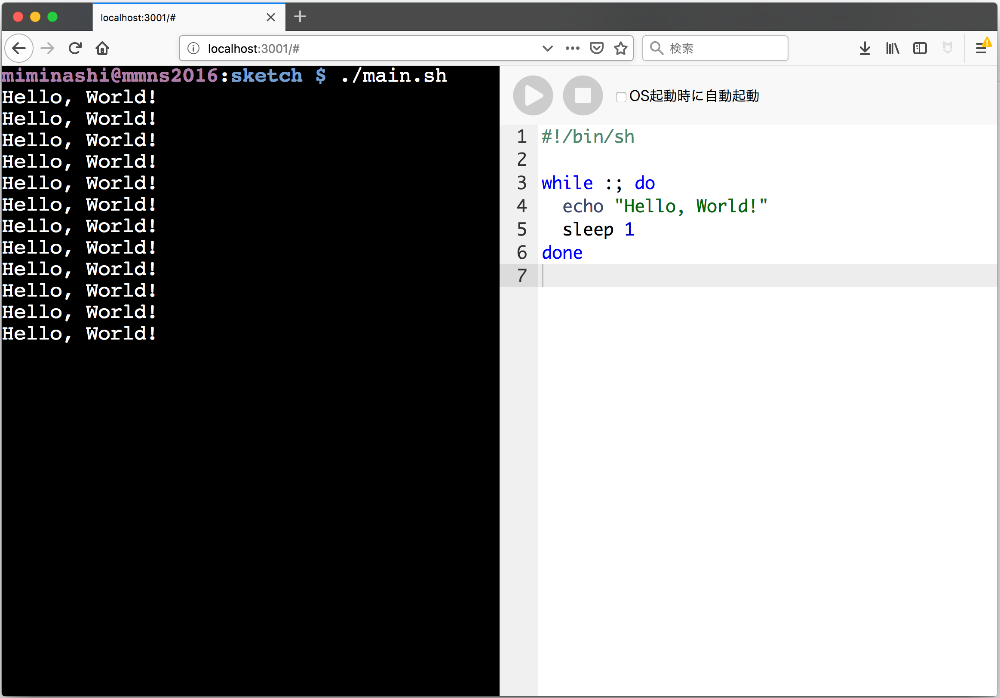

# PiDE



## これはなに？

RaspberryPiなどのボードコンピュータやローカルサーバで使える, ちょっとしたプロジェクトをすぐはじめてすぐ走らせるためのIDE.

## ローカルで起動する

### セットアップ

```sh
./setup.sh
```

### 起動

```sh
./server.sh
```

ブラウザで http://localhost:3001/ をひらく.

RaspberryPiで動かしている場合は, http://raspberrypi.local:3001/ など.


## Vagrantで起動する

```sh
./vagrant
```

ブラウザで http://localhost:3001/ をひらく.
(Vagrantfileでポートフォワーディングが設定されている)


## ライセンス

MIT

public/lib/fontawesome 以下の配布物は, public/lib/fontawesome/css/all.css に記載のライセンスに従います.


## 参考にしたサイト

- https://blog.tmyt.jp/entry/2017/01/07/175533
- https://codepen.io/nickmccurdy/pen/MwPpJy
- https://xtermjs.org/docs/api/addons/fit/
- https://jsfiddle.net/1zu5gydq/195/
- http://expressjs.com/ja/guide/error-handling.html
